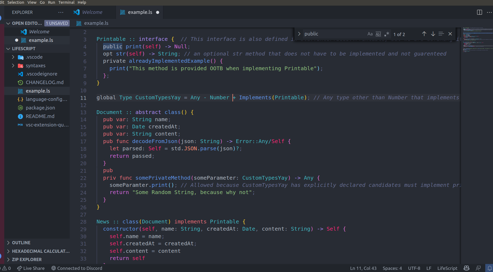

# LifeScript Integration
## What's in the folder

* `package.json` - this is the manifest file in we define language support and define the location of the grammar file that has been copied into your extension.
* `syntaxes/lifescript.tmLanguage.json` - this is the Text mate grammar file that is used for tokenization.
* `language-configuration.json` - this is the language configuration, defining the tokens that are used for comments and brackets.

## Add more language features

* We would love to see contributions for other language features, such as better bracket matching, or a way to do strings better.
* To add features such as intellisense, hovers and validators check out the VS Code extenders documentation at https://code.visualstudio.com/docs

## Install 

* To install this extension, clone it into the extensions folder at `<user home>/.vscode/extensions` folder and restart Code.
* A offical VS Code extension release will be available soon.
